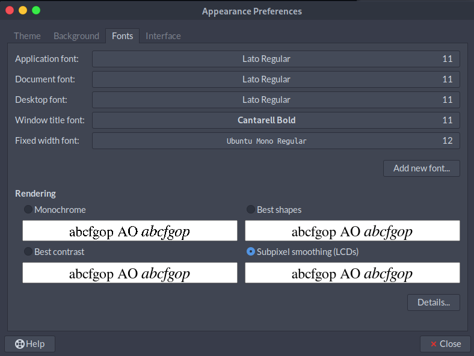
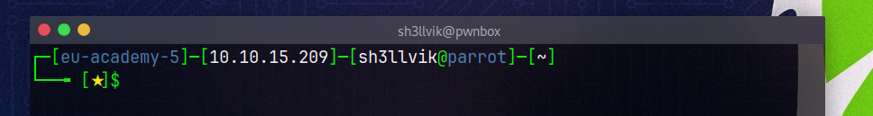

```bash
     ▄▄▄▀▄▄▄
▄▄▀▀▀       ▀▀▄▄▄
█▀▀▄▄         ▄▄▀▀█    █  █         ▐▌     ▄█▄ █          ▄▄▄▄
█    ▀▀▀▄▄▄▀▀▀    █    █▄▄█ ▀▀█ █▀▀ ▐▌▄▀    █  █▀█ █▀█    █▌▄█ ▄▀▀▄ ▀▄▀
█        █        █    █  █ █▄█ █▄▄ ▐█▀▄    █  █ █ █▄▄    █▌▄█ ▀▄▄▀ █▀█
█        █        █
█        █        █    P  E  N   -   T  E  S  T  I  N  G     L  A  B  S
▀▀▄▄     █     ▄▄▀▀
    ▀▀▀▄▄█▄▄▀▀▀
    
```


---

## Clone the repo
```bash
git clone https://github.com/shellvik/hbox
```
## Install
### Install Mate Desktop Environment
- This will install complete MATE desktop(Required in Kali, Parros HTB edition has MATE by default).
```bash
sudo apt-get install mate-desktop-environment
```
- Or install the base packages required for a minimal MATE desktop: `mate-desktop-environment-core`.
- Or install the complete MATE desktop including a few extras: `mate-desktop-environment-extras`

### Run Install Script
```bash
cd hbox
sudo chmod +x install.sh
./install.sh
```
## Visual Changes
### Selecting Theme
- Change the DE to MATE.
- Go to `Appearence Preferences` : In the top bar, click on : `System` >> `Preferences` >> `Look and Feel` >> `Appearance`.
- Change the theme : `Appearence Preferences` >> `Theme` >> `HackTheBox`.
### Setting Fonts
- Go to `Appearence Preferences` >> `Fonts`: 


## Customizing Terminal
- **Terminal Emulator** : *Kitty*, *Terminator*.
- **Bash Prompt** : HTB Pwnbox

- **Zsh Prompt** : Default OMZ prompt.
- Installation : 
```bash
sh -c "$(curl -fsSL https://raw.githubusercontent.com/ohmyzsh/ohmyzsh/master/tools/install.sh)"
```

## Keep OpenVPN at right place
- Keep academy and lab vpn in : `/etc/htb-vpn-config/` as `aca-htb.ovpn`
and `lab-htb.ovpn`.
- **Connecting to vpn**:
```bash
shvpn {aca|lab}
```


